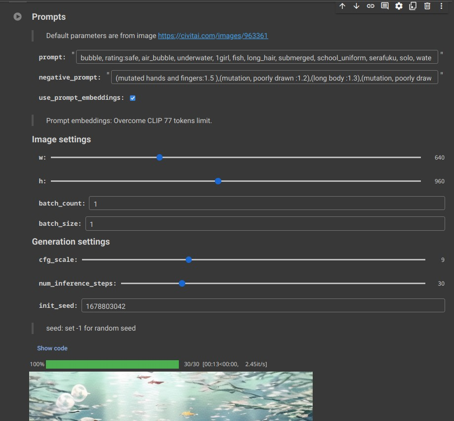

# Stable Diffusion Notebook UI

The primary objective of this project is to simplify and expedite the evaluation process for Stable Diffusion models. However, you may also use it to generate images, explore Stable Diffusion pipelines, conduct  experiments, and more.

## Usage

Just open the notebook using online platforms such as Colab, Kaggle, etc.

## Example output

## Contribute

Contributions are encouraged! However, please **remember to remove any private information** before submitting your code.

## Todo

- [ ] Produce same result as Stable Diffusion web UI under default settings
- [ ] Scheduler settings
- [ ] ENSD support
- [ ] Save image with parameters
- [ ] Custom models
  - [ ] VAE
  - [ ] LORA
  - [ ] ControlNet

- [x] Multi-GPU supports
- [x] img2img
- [ ] Upload image
- [ ] Notebook Testing CI
  - [x] CPU CI
  - [ ] GPU CI?

## References

-  https://medium.com/@natsunoyuki/using-civitai-models-with-diffusers-package-45e0c475a67e
- https://github.com/woctezuma/stable-diffusion-colab
- https://github.com/huggingface/diffusers/issues/2136
- https://huggingface.co/docs/diffusers/using-diffusers/weighted_prompts
- https://github.com/AUTOMATIC1111/stable-diffusion-webui/
